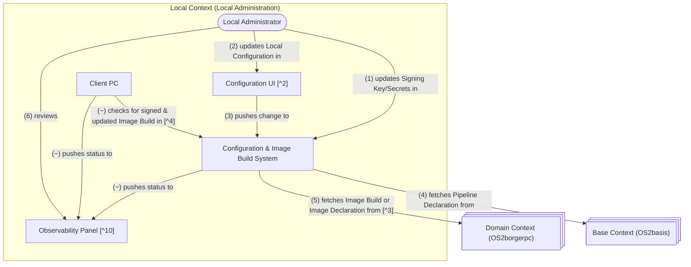
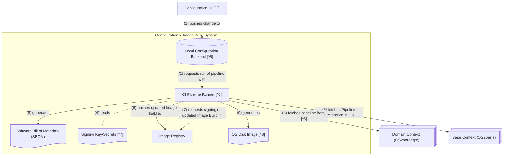

Document Context: **What?** This document outlines the design principles that we will follow during the implementation of the Build Pipeline for this project. **Why?** This document has been created during the prototyping phase for this project. We need to understand how to create Image Builds that can be shown during the prototype presentation. We also want to ensure that some of the logic we are creating can be re-used during the actual implementation phase, and that we are not encoding architectural patterns into the pipeline that we will later come to regret.

---

# Language

Throughout the following document, we use this ubiquitous language:
- Local Configuration: The non-sensitive part of the configuration, based on which properties of a local Image Build are set.
- Local Context, Domain Context, Base Context: The bounded contexts that correspond to the the Local Administration, OS2borgerpc and OS2basis organizations.
- Image Stream: The set of image builds that are associated with multiple image versions generated by one Local Configuration.
- Image Build: An individual OCI Image that has an image tag in an Image Stream.
- Image Declaration: The recipe/declaration that describes how an Image Build is produced.
- Disk Image: A file that is used to install an operating system onto a computer, like an ISO file or a file used for PXE booting.

# Prototype Build Flow

The prototype build flow is explained in a separate document [./image_build_prototype.md].

This flow is a subset of an envisioned build flow covers more production needs, and to explain the decisions that underlie this prototype flow, we present them in the context of such a more complete flow.

# Envisioned Build Flow

The following diagrams depict components and relationships that were found while exploring the "happy path" of an Image Build (i.e. a build without unexpected events).

Notes: 

1. At some point during planning, alternative routes should be explored, as this will probably lead to the discovery of more required components.
2. A component falling into a certain context means that this context owns the responsibility for the runtime of this component. It does not say anything about which project develops a component, or how components are sourced.

## Coarse Diagram

## Detail on Configuration & Image Build System:

## Explanations

### Note 2
Why is there a separate Configuration UI?

- The Configuration UI exists because we expect the Local Administrator user to have only little experience with the Local Configuration text files. We do not expect the Local Administrators to be comfortable editing structured data and creating git commits.

Why does the Configuration UI configure the Local Configuration, but not the Signing Key/Secrets?

- How interfaces are designed depends on (1) whether signing key/other secrets storage will live outside the Local Configuration Backend, and (2) whether the person who maintains the Local Configuration will also handle signing key setup.
- There is no need to provide a unified configuration UI for secret and non-secret data, if those two types of data are to be handled by different people
- Setting up a signing key is a one-time operation - we're therefore only gaining little in user-friendliness by implementing a UI for this task

### Note 3

Open Question: Which of the following build paths is preferrable?
(1) The Domain Context (and the Base Context) each maintain their own Image Builds, and the local Image Build process refers to those Image Builds as a base
(2) The Image Build process in the Local Context fetches the Image Declaration for the Base Context and the Domain Context, and builds their Image Builds themselves.

- what speaks for approach (1): to ensure that their changes work at all, both of those projects are required to have access to an Image Build pipeline, even if just at the stability level required for a testing system. the savings are therefore not as pronounced as if all Image Build creation could be circumvented. furthermore, since os2basis owns the pipeline declaration, it would be advantageous to let them have a system where they build Image Builds under the same conditions as Local Contexts do.
- what speaks for approach (2): Should the Local Context be able to rely on being able to pull a pre-existing Image Build from the Domain Context, then this would require existing infrastructure in both the Domain Context and the Base Context: both of them must be able to distribute and sign Image Builds in an image registry. The projects backing the Domain Context and the Base Context could avoid the costs of a production-grade image build pipeline by moving Image Build creation to the Local Context.

-> Because of the lack of clarify about the nature and the resources of the os2basis project, we need to stay uncommital towards the approach at this point.

### Note 4

Why does the Client PC rely on regularly querying the image registry for updates?

- Currently, there is a lack of clarity about whether other user needs require us to add a control plane to the system, and what such a control plane might look like. Therefore, This design avoids the assumption that such a control plane exists, and the self-update capability itself does not necessitate such a component. The Client PC regularly checks the Image Stream for new versions.
- This design causes a decrease in flexibility: What if a change in configuration is required as part of a change in the environment? For example, if new hardware is attached to the network that demands a change in configuration. In that case, the functionality would break until the automatic self-update has taken place. A simple way to mitigate this problem would be to have the Client PC pull new updates at high frequency, without applying them right away. That way, if a user notices a degradation in functionality, they can reboot the Client PC to then trigger the update to the latest configuration.
- Risk: If the Local Administration pushes an update that breaks Network functionality, they will have to manually run `bootc rollback` on every device. (If needed, a mechanism can be developed that checks for network health on boot and automatically rolls back if a degradation has been discovered.)

### Note 5

Why is the Local Configuration stored in a VCS?

- Despite the lack of usability provided by VCS user interfaces, we are choosing to store the Local Configuration as a text file in a VCS system. Using a VCS for storage of the Local Configuration means that all changes are stored as user-attributed transactions, which can easily be rolled back.
- Open Question: How is auth handled between the configuration UI and the Local Configuration Backend? We only gain attribution if logging into the configuration UI also authenticates the Local Administrator as a user in the VCS system. (I.e. using a generic "system" account in the backing VCS is a no-go.)

At the current development stage, we decide on a 1:1 mapping between Local Configurations and their associated Image Streams. (I.e. for every Local Configuration, there is a separate repository). Why?

- This means that we don't need to maintain a templating logic for deriving multiple Local Configurations from a single template.
- Downside: If Local Administrators end up having to maintain a lot of Local Configurations with mostly similar settings, this would create a lot of boilerplate.
- For now, we have enough understanding of what the actual use case looks like, so we should go with the less complex solution. Once we know if this approach poses unacceptable challenges, we can develop a more flexible solution.
- Open question: How do we allow Local Administrators to have a test/staging system? We would want the Local Administrator to be able to try out their configuration on a single device before rolling it out to everyone. In the current design, the Local Administrator would have to maintain a separate "testing" Local Configuration which they then copy onto the "production" Local Configuration once they are satisfied.

### Note 6

Why is the CI Pipeline Runner part of the Local context?

- This is because "image lifetime management" is the Local Administration's concern, and therefore, the directly related tooling should be part of their context.
- It is not necessary to allow the projects backing the Domain Context or the Base Context to invoke the creation of new Image Builds at the Local Context, as the Client PC's timed self-update process means that such an action would have little effect.
- In practice, the Local Administration could implement this by owning an account in a SaaS-like service, maybe even one provided by teams related to the Domain Context or the Base Context.

Why is a new Image Build created with every Local Configuration change?

In theory, an alternative way of tracking Local Configuration changes could be one where a client software is running on the Client PC which (1) tracks the Local Configuration and (2) applies changes to the Client PC configuration in accordance with the changes in the Local Configuration.
However, the setup I propose, where we build Image Builds for every Local Configuration change, has two key advantages: 
- All updates, whether system components or Local Configuration, can be managed through the bootc interface,
- We can sign Local Configuration changes (and therefore attest them) the same way we sign new Image Builds. We do not need a separate signing system for the Local Configuration.
- From a feasibility perspective, it is doubtful whether all Local Configuration can fit a form that client software on the machine can safely apply
- Using the Image Build process for this allows us to reuse the infrastructure that creates Image Builds in the Domain Context.
- Besides running on every Local Configuration change, the Image Build process is also run on a regular interval, in order to fetch the latest updates provided through the Domain Context.

### Note 7

Design Notes regarding the Signing Key/Secrets storage:

- This model tries to be agnostic towards how the signing key or other secrets are actually stored and mananged. We can store the signing key (or other secrets) in various ways, each with different upsides and downsides.
- At the current time, we want to not commit on a specific secrets storage implementation or secrets management design pattern. There is still too little clarity on which kinds of secrets we need to store at all, and which distribution methods those require.
- It is against common advice make sensitive information, like a wifi password, part of an Image Build. This would then force us to treat the entire Image Build as sensitive. While most container image infrastructure lets us restrict access to an Image Build to authenticated users, tooling is usually developed with the assumption that Image Builds do not contain highly sensitive data. As far as feasible, we should therefore try to not put any secret information onto the Image Builds, i.e. treat them as if they could just as well be distributed publicly.
- Underlying hypothesis: We assume that entering if secrets is only needed in situations where it is acceptable to expect the Client PC user to enter a secret (like a secret wifi password) on demand, if needed. (Which also means that we assume that in a public PC context, no secrets need to be entered.)

### Note 8

Design Notes regarding the Disk Image Store:
- As far as the implementation of the Disk Image Store is concerned, this does not need to be a separate software system. For example, VCS systems usually support attaching files to a repository as part of a "release".

### Note 9

Why is the Pipeline Declaration a separate component outside of the Local Context?

- The Local Context does not own any pipeline logic. This is because (1) the functionality of the pipeline should be independent of the Local Configuration the Local Context maintains, and (2) they should not need to modify the pipeline.

Why is the Pipeline Declaration owned by the Base Context (OS2basis)?

- It is up for debate whether this should be part of the Base Context, the Domain Context, or entirely separate.
- There is little need for customization of the pipeline declaration on a domain level: How to build an OS image should mostly be uniform across OS2basis projects.
- Risk: The scope of OS2basis project is still unclear at the moment, and this makes it challenging to say how different build processes actually would be between the different contexts.

Design Notes:
- The Pipeline Declaration should be written in a format that can easily be transferred between CI Pipeline systems (Interoperability). There is little to gain from using modules that are specific to one CI system, whereas using such modules opens up various supply chain challenges.
- Open Question: How do we ensure that the Pipeline Declaration is authentic? Forging a Pipeline Declaration would break any other security guarantees during the build process.

### Note 10

Design Note: The "Observability Panel" is meant to be used by the Local Administrator role without technical training. It is meant to be an interface that informs the Local Administrator about the health of machines, and the status of rollouts, and potentially other information that is discovered to be relevant during development.

Furthermore, there is a possibility that Local Administrators will expect to be able to manipulate running Client PCs. At this time, an evauation of potentially required components to support this feature is out of scope of this document.
