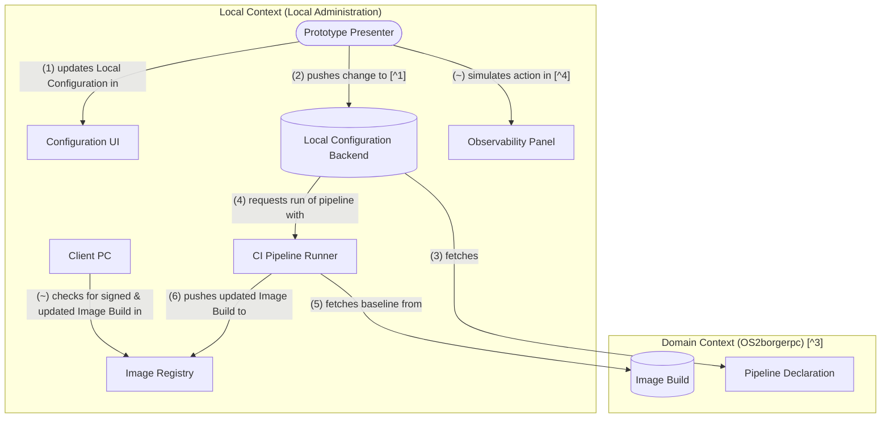

This document is an addendum to [./image_build_design.md]. It describes how we combine components to create a minimally acceptable prototype of this project.

The components used in the prototype presentation should follow this flow:

Design decisions and language related to the envisioned production pipeline can be found in the [./ci_pipeline_design.md] document.

The following notes explain why decisions where made where the prototype deviates from the Envisioned Build Flow in [./ci_pipeline_design.md].

### Note 1

Why does the Configuration UI in the prototype not perform changes to the Local Configuration Backend directly?

- As discussed in Note 5, the interaction between the Configuration UI and the Local Configuration Backend poses challenges, especially when it comes to authentication. To avoid having to address those challenges right away, we have the Configuration UI as act a non-functional interface, and simulate its backend action by manually pushing the changes.
- Besides the authentication challenges, there is still a lot of uncertainty when it comes how the Configuration UI is going to be implemented - there are overlaps with the OS2basis project -, meaning that any work done now will likely have to be discarded.

### Note 2

Discussion: Should the building of Disk Images (ISO, PXE Boot) be part of the prototype phase of this project?

- It is unclear which install format would be most appropriate for the local administration's use case. In some cases, an ISO might be more appropriate, but I am not sure if this is the appropriate format for the Network Install that a lot of administrators will desire.
- For the sake of demoing and testing, it is possible to install an OS2borgerpc OS onto a Client PC without creating a Disk Image: Once can start with a minimal Disk Image from an external project that uses bootc, and then use `bootc switch` to convert it into the most recent OS2borgerpc OS. It is even possible to use an old version of a Desk Image created by this project, and then run `bootc update --apply` on it. By avoiding regular Disk Image builds, we are saving ourselves the complexity of having to handle multiple build types early on during development.
- However, if we want stakeholders to see a seamless install at the presentation, and the `bootc update` method is not acceptable, then an ISO build (or something similar) would be necessary.
- Maintaining a Disk Image build process during the prototype phase increases complexity and development time. Whether we want to invest this time depends on what feature presentation will convince stakeholders.

-> At this point we work in the assumption that a mitigation using a different Disk Image is acceptable.

### Note 3

Why is the Pipeline Declaration moved to the Domain context, even though the Envisioned Model has it in the Base Context? Why is the Base Context missing from this model?

- The prototype currently does not account for the existence of a Base Context. We believe that we would be overcomplicating the prototyping process if we manufacture a separate "dummy" Base Context stub, just to reflect this aspect of the model. A Pipeline Declaration that has been created in the Domain Context can easily be moved to a Base Context. After all, both locations share the key trait that no Pipeline Declaration logic is contained in the Local Context.
- The Image Declaration produced by the Base Context is circumvented in the prototype by using an off-the-shelf base Image Stream as a base for the Domain Context Image Declaration. Caution has to be taken that the Domain Context Image Declaration does not depend on implementation details of those off-the-shelf Image Streams.

### Note 4

Why is the Observability Panel part of the prototype, but only simulated?

- The Observability Panel visualizes information that is important to the Local Administration role. It covers Concerns 3 and 4 as depicted in [./prototype_strategy.md].
- At the same time, implementing observability can be incredibly time-consuming. Lots of moving parts within the system have to be connected, those connections have to be tested, and panels have to be configured to actually display relevant information.
- The need for observability is shared by other projects in the OS2basis family, meaning that there will be a lot of similar projects with opinions and needs on how observability should be implemented. Any work done now will likely have to be re-done once those projects are established.
- Therefore, we believe that it is an acceptable compromise to show a "dummy" observability panel during the presentation that is not connected to the actual system. If the presenter transparently enters information from the system into the observability panel, and shows the audience how this information would be presented, it should be believable to Local Administrators that such a transfer of information can be autoamted during development.

### Other omitted components

We believe that the following sub-domains do not further the strategic goals for the prototype presentation: Image Signing, Secret Management, SBOM Generation, Scheduled Rebuilds

Those sub-domains address supply chain challenges, and we do not expect the audience at a prototype presentation to be worried about how we handle software supply chains.
